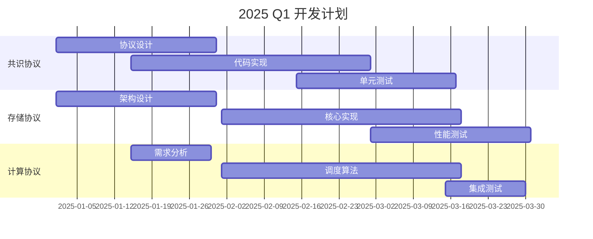

# DAIC 实施路线图

## 🗺️ 总体概述

本路线图详细描述了Decentralized AI Commons (DAIC)项目的实施计划，涵盖从技术开发到生态建设的各个阶段。

## 🎯 核心目标

### 长期愿景 (3-5年)
1. **构建完整的去中心化AI基础设施**
2. **建立全球最大的分布式AI计算网络**
3. **实现"全民数字主权"的愿景**
4. **成为AI民主化的关键基础设施**

### 中期目标 (1-3年)
1. **技术协议成熟稳定**
2. **生态应用丰富多样**
3. **社区治理完全去中心化**
4. **全球节点网络建立**

### 短期目标 (0-1年)
1. **核心协议开发完成**
2. **测试网稳定运行**
3. **开发者社区建立**
4. **首批生态应用上线**

## 📅 详细路线图

### 阶段1: 基础协议 (2025年Q1-Q2)

#### 技术目标
- [ ] **共识协议V1.0**
  - DAG-PoS混合共识实现
  - 测试网部署
  - 安全审计完成

- [ ] **存储协议V1.0**
  - 分布式存储网络
  - 存储证明机制
  - 数据冗余和恢复

- [ ] **计算协议V1.0**
  - 基础任务调度
  - 资源匹配算法
  - 容器化执行环境

#### 社区目标
- [ ] **开发者社区建设**
  - 技术文档完善
  - 开发者工具包发布
  - 首次黑客松活动

- [ ] **测试网激励计划**
  - 早期节点奖励
  - Bug bounty计划
  - 社区贡献奖励

#### 里程碑
- **2025年3月**: 测试网Alpha版本发布
- **2025年4月**: 开发者工具包发布
- **2025年5月**: 首次安全审计完成
- **2025年6月**: 测试网Beta版本发布

### 阶段2: AI集成 (2025年Q3-Q4)

#### 技术目标
- [ ] **AI框架集成**
  - 联邦学习框架
  - 分布式训练优化
  - 模型推理服务

- [ ] **智能体平台**
  - 智能体开发框架
  - 任务编排系统
  - 结果验证机制

- [ ] **模型市场**
  - 模型上传和验证
  - 模型交易机制
  - 版权保护系统

#### 生态目标
- [ ] **首批应用上线**
  - 分布式AI训练平台
  - 数据标注市场
  - 模型推理服务

- [ ] **合作伙伴拓展**
  - AI研究机构合作
  - 数据提供商接入
  - 硬件厂商合作

#### 里程碑
- **2025年7月**: 联邦学习框架发布
- **2025年8月**: 智能体平台Alpha
- **2025年9月**: 模型市场测试版
- **2025年10月**: 主网V1.0发布

### 阶段3: 硬件扩展 (2026年Q1-Q2)

#### 技术目标
- [ ] **开源硬件设计**
  - 安全芯片设计
  - 可信执行环境
  - 硬件认证协议

- [ ] **具身智能平台**
  - 机器人操作系统集成
  - 3D打印接口
  - 传感器数据融合

- [ ] **边缘计算优化**
  - 边缘节点部署
  - 低延迟优化
  - 能耗优化

#### 硬件目标
- [ ] **硬件认证计划**
  - 存储设备认证
  - GPU设备认证
  - 网络设备认证

- [ ] **制造合作伙伴**
  - 芯片制造商合作
  - 设备制造商合作
  - 供应链建立

#### 里程碑
- **2026年1月**: 开源硬件设计发布
- **2026年2月**: 硬件认证计划启动
- **2026年3月**: 具身智能平台Alpha
- **2026年4月**: 边缘计算网络建立

### 阶段4: 生态系统 (2026年Q3-Q4)

#### 生态目标
- [ ] **跨链互操作性**
  - 多链资产桥接
  - 跨链消息传递
  - 统一身份系统

- [ ] **企业级解决方案**
  - 企业私有部署
  - 合规性解决方案
  - 定制化服务

- [ ] **全球节点网络**
  - 区域数据中心
  - 边缘节点覆盖
  - 网络优化

#### 治理目标
- [ ] **完全去中心化治理**
  - DAO治理系统
  - 社区提案机制
  - 自动执行合约

- [ ] **生态基金建立**
  - 项目资助计划
  - 开发者激励
  - 研究资助

#### 里程碑
- **2026年7月**: 跨链互操作性实现
- **2026年8月**: 企业级解决方案发布
- **2026年9月**: 全球节点网络覆盖
- **2026年10月**: 完全去中心化治理

## 🔧 技术开发计划

### 2025年开发重点

#### Q1: 核心协议

#### Q2: 网络和测试
- **网络层开发**: P2P网络、节点发现、数据传输
- **测试网部署**: 多节点测试、压力测试、安全测试
- **开发者工具**: SDK、CLI工具、API文档

### 2026年开发重点

#### Q1-Q2: AI和硬件
- **AI框架集成**: 模型训练、推理优化、隐私保护
- **硬件接口**: 设备管理、资源调度、安全认证
- **边缘计算**: 低延迟优化、能耗管理、网络优化

#### Q3-Q4: 生态和治理
- **生态应用**: 应用市场、开发者平台、用户界面
- **治理系统**: 投票机制、提案系统、资金管理
- **跨链集成**: 资产桥接、消息传递、身份互通

## 👥 团队建设计划

### 核心团队扩展
| 时间 | 技术团队 | 研究团队 | 产品团队 | 社区团队 |
|------|----------|----------|----------|----------|
| 2025 Q1 | 10人 | 5人 | 5人 | 3人 |
| 2025 Q4 | 25人 | 10人 | 10人 | 8人 |
| 2026 Q4 | 50人 | 20人 | 15人 | 15人 |

### 社区贡献者目标
- **2025年底**: 1000+ GitHub贡献者
- **2026年底**: 5000+ GitHub贡献者
- **长期目标**: 10000+活跃贡献者

## 💰 资金使用计划

### 开发资金分配
| 类别 | 比例 | 说明 |
|------|------|------|
| 技术开发 | 40% | 工程师薪资、基础设施 |
| 研究投入 | 20% | 密码学研究、AI研究 |
| 生态建设 | 15% | 开发者激励、黑客松 |
| 市场推广 | 10% | 品牌建设、社区活动 |
| 法律合规 | 10% | 法律咨询、合规成本 |
| 应急储备 | 5% | 风险应对、机会把握 |

### 里程碑资金释放
1. **测试网发布**: 释放20%资金
2. **主网V1.0**: 释放30%资金
3. **生态应用上线**: 释放25%资金
4. **完全去中心化**: 释放25%资金

## 📊 关键绩效指标 (KPI)

### 技术指标
- **网络性能**: TPS > 10,000，延迟 < 100ms
- **存储容量**: 支持EB级存储，冗余3倍以上
- **计算能力**: 聚合算力 > 100 PFLOPS
- **节点数量**: 主网节点 > 10,000个

### 生态指标
- **开发者数量**: 活跃开发者 > 1,000人
- **应用数量**: 生态应用 > 100个
- **用户数量**: 月活跃用户 > 100,000人
- **交易量**: 日均交易 > 1,000,000笔

### 社区指标
- **GitHub Stars**: > 10,000
- **Discord成员**: > 50,000
- **Twitter关注**: > 100,000
- **社区提案**: 月均 > 50个

## 🚨 风险管理

### 技术风险
1. **共识安全风险**
   - 应对措施: 多重共识机制、形式化验证
   - 监控指标: 双花攻击检测、网络分叉

2. **性能瓶颈风险**
   - 应对措施: 水平扩展、优化算法
   - 监控指标: TPS监控、延迟监控

3. **安全漏洞风险**
   - 应对措施: 安全审计、漏洞奖励
   - 监控指标: 漏洞报告、修复时间

### 市场风险
1. **竞争风险**
   - 应对措施: 技术差异化、生态建设
   - 监控指标: 市场份额、用户留存

2. **监管风险**
   - 应对措施: 合规设计、法律咨询
   - 监控指标: 法规变化、合规状态

3. **采用风险**
   - 应对措施: 开发者激励、用户体验优化
   - 监控指标: 开发者增长、用户增长

### 运营风险
1. **团队风险**
   - 应对措施: 人才储备、知识管理
   - 监控指标: 团队稳定性、知识传承

2. **资金风险**
   - 应对措施: 预算管理、多元化融资
   - 监控指标: 资金使用率、现金流

## 🔄 迭代和调整

### 季度评估
- **技术进展评估**: 每季度技术评审
- **生态发展评估**: 每季度生态报告
- **社区反馈收集**: 每季度社区调研

### 路线图调整
- **灵活调整**: 根据技术发展和市场需求调整
- **透明沟通**: 所有调整公开透明沟通
- **社区参与**: 重大调整需要社区投票

## 🤝 合作伙伴计划

### 技术合作伙伴
1. **开源基金会**: Linux基金会、Apache基金会
2. **研究机构**: 大学实验室、研究机构
3. **技术公司**: 云计算公司、硬件厂商

### 生态合作伙伴
1. **数据提供商**: 医疗、金融、教育数据
2. **应用开发者**: AI应用开发团队
3. **服务提供商**: 托管服务、咨询服务

### 投资合作伙伴
1. **风险投资**: 技术投资基金
2. **战略投资**: 行业龙头企业
3. **社区基金**: 去中心化自治组织

## 📈 成功标准

### 技术成功
- [ ] 共识协议稳定运行1年以上
- [ ] 存储网络无数据丢失记录
- [ ] 计算网络任务成功率 > 99.9%
- [ ] 安全审计无高危漏洞

### 生态成功
- [ ] 100+生态应用上线
- [ ] 1000+活跃开发者
- [ ] 100,000+月活跃用户
- [ ] 1,000,000+日均交易

### 社区成功
- [ ] 完全去中心化治理
- [ ] 社区提案执行率 > 80%
- [ ] 贡献者满意度 > 90%
- [ ] 社区自组织能力建立

## 📞 联系我们

对路线图有任何建议或想参与实施，请通过以下方式联系我们：

- **GitHub Issues**: https://github.com/daic-org/daic-core/issues
- **Discord**: https://discord.gg/daic
- **Email**: roadmap@daic.org

---

*最后更新: 2025年2月25日*  
*版本: 1.0.0*  
*注意: 本路线图会根据实际情况进行调整，最新版本请查看GitHub仓库。*